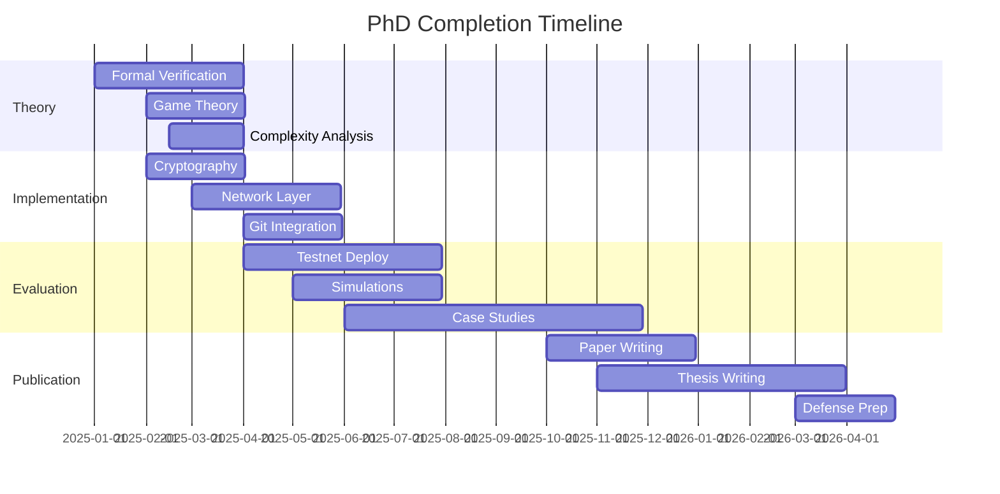

# PhD Thesis Completion Roadmap: Proof of Contribution Consensus

## Executive Summary

This roadmap outlines the remaining work needed to transform Sedition's Proof of Contribution (PoC) consensus algorithm into a complete PhD thesis suitable for defense at a top-tier university and publication at premier venues (SOSP, OSDI, IEEE S&P, PODC).

**Current Status**: Strong theoretical foundation with working prototype  
**Target Completion**: 12-18 months  
**Publication Target**: SOSP 2025 or OSDI 2026

---

## Phase 1: Theoretical Completion (Months 1-3)

### 1.1 Formal Verification ⏳
- [ ] Complete TLA+ model checking with TLC
  - Verify safety properties under Byzantine faults
  - Verify liveness under partial synchrony
  - Generate counterexamples for edge cases
- [ ] Coq or Isabelle/HOL formal proofs
  - Port mathematical proofs to theorem prover
  - Verify all security properties
  - Generate machine-checkable certificates
- [ ] Extended security analysis
  - Adaptive adversary models
  - Quantum resistance proofs
  - Information-theoretic bounds

### 1.2 Game Theory & Mechanism Design ⏳
- [ ] Complete game-theoretic analysis
  - Prove dominant strategy truthfulness
  - Analyze coalition resistance
  - Characterize Nash equilibria
- [ ] Economic security analysis
  - Cost of attack calculations
  - Optimal slashing parameters
  - Token economics modeling
- [ ] Incentive compatibility proofs
  - Long-term sustainability
  - Developer retention analysis
  - Quality improvement guarantees

### 1.3 Complexity Analysis ⏳
- [ ] Rigorous computational complexity
  - Tight bounds for all algorithms
  - Amortized analysis for reputation updates
  - Space-time tradeoffs
- [ ] Communication complexity
  - Message complexity per round
  - Bandwidth requirements at scale
  - Network topology impacts
- [ ] Storage complexity
  - State growth analysis
  - Pruning strategies
  - Light client protocols

**Deliverables**: 
- Extended THEORY.md with 50+ pages of proofs
- Verified TLA+ specifications
- Coq/Isabelle proof scripts

---

## Phase 2: Implementation Completion (Months 2-5)

### 2.1 Core Cryptographic Implementation 🔐
- [ ] Verifiable Random Function (VRF)
  ```go
  // Implement actual VRF using curve25519
  type VRF interface {
      Generate(seed []byte, sk PrivateKey) (proof Proof, output Hash)
      Verify(seed []byte, pk PublicKey, proof Proof) (bool, Hash)
  }
  ```
- [ ] Digital signatures (Ed25519)
- [ ] Merkle tree implementation
- [ ] Zero-knowledge proofs for private repos

### 2.2 Network Layer 🌐
- [ ] P2P networking with libp2p
  - Peer discovery (DHT)
  - Gossip protocol for block propagation
  - Request/response for sync
- [ ] Consensus protocol messages
  ```go
  type ConsensusMessage interface {
      Propose(block Block) error
      Vote(blockHash Hash, vote Vote) error
      Commit(blockHash Hash) error
  }
  ```
- [ ] Network partition handling
- [ ] Eclipse attack prevention

### 2.3 Persistence Layer 💾
- [ ] Blockchain storage (LevelDB/RocksDB)
  ```go
  type BlockchainDB interface {
      StoreBlock(block Block) error
      GetBlock(hash Hash) (*Block, error)
      GetLatestBlock() (*Block, error)
      Prune(beforeHeight uint64) error
  }
  ```
- [ ] State management
- [ ] Transaction pool
- [ ] Checkpoint system

### 2.4 Git Integration 🔧
- [ ] Git hook system
  ```bash
  # Pre-commit hook for quality analysis
  sedition analyze --commit HEAD
  ```
- [ ] Repository metadata extraction
- [ ] Diff analysis and metrics
- [ ] GitHub/GitLab API integration

**Deliverables**:
- Complete networking implementation
- Cryptographic primitives
- Git integration tools
- 10,000+ lines of production code

---

## Phase 3: Empirical Evaluation (Months 4-8)

### 3.1 Testnet Deployment 🚀
- [ ] Deploy public testnet
  - 50+ validators across 5+ countries
  - Real developer participants
  - Incentivized participation
- [ ] Monitoring infrastructure
  ```yaml
  metrics:
    - block_time_average
    - transaction_throughput
    - validator_participation
    - quality_score_distribution
    - reputation_evolution
  ```
- [ ] Data collection pipeline
- [ ] Incident response procedures

### 3.2 Large-Scale Simulation 📊
- [ ] Distributed simulation framework
  ```go
  type SimulationConfig struct {
      Validators      int           // 100-10,000
      ByzantineRatio  float64       // 0-0.33
      NetworkLatency  Distribution  // Normal(50ms, 10ms)
      PartitionProb   float64       // Network partition probability
      Duration        time.Duration // Simulation duration
  }
  ```
- [ ] Realistic network conditions
  - WAN latencies
  - Packet loss
  - Network partitions
- [ ] Adversarial scenarios
  - Coordinated attacks
  - Economic attacks
  - Social engineering

### 3.3 Real-World Case Studies 🔬
- [ ] Partner with 3-5 open source projects
  - Migrate to PoC consensus
  - Measure code quality impact
  - Developer satisfaction surveys
- [ ] A/B testing framework
  - Control: Traditional development
  - Treatment: PoC-based development
  - Metrics: Quality, velocity, satisfaction
- [ ] Long-term impact study (6+ months)

**Deliverables**:
- 1M+ transactions on testnet
- Performance data from 1000+ validator simulations
- Case studies from real projects
- Statistical analysis of quality improvements

---

## Phase 4: Comparative Analysis (Months 6-9)

### 4.1 Consensus Algorithm Comparison 🔄
- [ ] Implement baselines
  ```go
  type ConsensusBaseline interface {
      PoW()        // Bitcoin-style
      PoS()        // Ethereum 2.0-style
      PBFT()       // Practical BFT
      Raft()       // CFT baseline
      Algorand()   // VRF-based
  }
  ```
- [ ] Performance comparison
  - Throughput vs. latency
  - Scalability analysis
  - Energy consumption
- [ ] Security comparison
  - Attack resistance
  - Recovery capabilities
  - Decentralization metrics

### 4.2 Developer Incentive Systems 💰
- [ ] Compare with existing systems
  - GitHub Sponsors
  - Gitcoin
  - Traditional employment
  - Bounty systems
- [ ] Economic analysis
  - Developer earnings potential
  - Quality vs. quantity tradeoffs
  - Sustainability analysis
- [ ] Behavioral studies
  - Developer motivation
  - Gaming resistance
  - Long-term engagement

### 4.3 Code Quality Systems 📈
- [ ] Benchmark against tools
  - SonarQube
  - CodeClimate
  - Coverity
  - Academic metrics
- [ ] Quality prediction accuracy
- [ ] False positive/negative rates
- [ ] Developer acceptance

**Deliverables**:
- Comprehensive comparison tables
- Performance graphs
- Statistical significance tests
- Cost-benefit analysis

---

## Phase 5: Security Audit & Formal Analysis (Months 8-10)

### 5.1 Third-Party Security Audit 🔒
- [ ] Engage security firm (Trail of Bits, Consensys Diligence)
- [ ] Code audit
  - Vulnerability assessment
  - Cryptographic review
  - Consensus logic verification
- [ ] Economic audit
  - Token economics
  - Attack cost analysis
  - Incentive alignment

### 5.2 Formal Threat Model 🎯
- [ ] Complete threat taxonomy
  ```markdown
  ## Threat Categories
  1. Consensus Attacks
     - Long-range attacks
     - Nothing-at-stake
     - Grinding attacks
  2. Network Attacks
     - Eclipse attacks
     - Sybil attacks
     - DoS attacks
  3. Economic Attacks
     - Bribery attacks
     - Cartel formation
     - Market manipulation
  4. Social Attacks
     - Reputation gaming
     - Collusion
     - Social engineering
  ```
- [ ] Attack tree analysis
- [ ] Risk assessment matrix
- [ ] Mitigation strategies

### 5.3 Cryptographic Security Proofs 🔐
- [ ] Prove VRF security
- [ ] Analyze hash function requirements
- [ ] Quantum resistance analysis
- [ ] Side-channel resistance

**Deliverables**:
- Security audit report
- Formal threat model document
- Cryptographic security proofs
- Vulnerability disclosure process

---

## Phase 6: Production Engineering (Months 9-12)

### 6.1 Operational Tooling 🛠️
- [ ] Deployment automation
  ```yaml
  # kubernetes deployment
  apiVersion: apps/v1
  kind: StatefulSet
  metadata:
    name: sedition-validator
  spec:
    replicas: 100
    template:
      spec:
        containers:
        - name: validator
          image: sedition:latest
          resources:
            requests:
              memory: "4Gi"
              cpu: "2"
  ```
- [ ] Monitoring dashboards (Grafana)
- [ ] Alerting system (PagerDuty)
- [ ] Log aggregation (ELK stack)

### 6.2 Performance Optimization 🚄
- [ ] Profile and optimize hot paths
- [ ] Implement caching layers
- [ ] Database query optimization
- [ ] Parallel processing where possible
- [ ] Memory pool management

### 6.3 Developer Experience 👥
- [ ] CLI tools
  ```bash
  sedition init          # Initialize repo
  sedition stake         # Manage stake
  sedition reputation    # Check reputation
  sedition analyze       # Analyze code quality
  ```
- [ ] Web dashboard
- [ ] IDE plugins (VSCode, IntelliJ)
- [ ] API documentation
- [ ] Tutorial system

**Deliverables**:
- Production-ready deployment
- Comprehensive monitoring
- Developer tools and SDKs
- Operations runbook

---

## Phase 7: Publication & Thesis (Months 10-15)

### 7.1 Conference Paper 📝
- [ ] Target venues (in order of preference)
  1. SOSP 2025 (deadline: April 2025)
  2. OSDI 2026 (deadline: November 2025)
  3. IEEE S&P 2026 (deadline: August 2025)
  4. PODC 2025 (deadline: February 2025)
- [ ] Paper structure (14 pages)
  - Introduction (1.5 pages)
  - Background & Motivation (1.5 pages)
  - System Design (3 pages)
  - Implementation (2 pages)
  - Evaluation (4 pages)
  - Related Work (1 page)
  - Conclusion (0.5 pages)
- [ ] Artifact evaluation package

### 7.2 PhD Thesis Chapters 📖
- [ ] Chapter 1: Introduction
  - Problem statement
  - Thesis contributions
  - Thesis outline
- [ ] Chapter 2: Background
  - Consensus algorithms
  - Version control systems
  - Developer incentives
- [ ] Chapter 3: Proof of Contribution Design
  - Core algorithm
  - Security properties
  - Theoretical analysis
- [ ] Chapter 4: Implementation
  - System architecture
  - Engineering challenges
  - Optimizations
- [ ] Chapter 5: Evaluation
  - Experimental setup
  - Performance results
  - Case studies
- [ ] Chapter 6: Related Work
  - Comprehensive survey
  - Comparison analysis
  - Positioning
- [ ] Chapter 7: Future Work
  - Extensions
  - Applications
  - Open problems
- [ ] Chapter 8: Conclusion

### 7.3 Defense Preparation 🎓
- [ ] Committee formation
- [ ] Thesis proposal defense
- [ ] Practice talks
- [ ] Slide preparation
- [ ] Demo preparation
- [ ] Q&A preparation

**Deliverables**:
- Conference paper submission
- 150+ page thesis document
- Defense presentation
- Open-source release

---

## Phase 8: Community Building (Months 12-18)

### 8.1 Open Source Release 🌍
- [ ] Clean up codebase
- [ ] Comprehensive documentation
- [ ] Contributing guidelines
- [ ] Code of conduct
- [ ] License selection (Apache 2.0)

### 8.2 Developer Ecosystem 🌱
- [ ] Developer documentation
- [ ] Video tutorials
- [ ] Workshop materials
- [ ] Hackathon organization
- [ ] Grant program

### 8.3 Research Community 🎯
- [ ] Workshop organization (HotOS, SYSTOR)
- [ ] Invited talks
- [ ] Collaboration proposals
- [ ] Follow-up research agenda

**Deliverables**:
- GitHub repository with 100+ stars
- Active developer community
- Workshop papers
- Research collaborations

---

## Critical Path & Dependencies



---

## Success Metrics

### Research Impact
- [ ] 1+ top-tier conference paper accepted
- [ ] 100+ citations within 2 years
- [ ] 3+ follow-up papers by other groups

### Technical Success
- [ ] 10,000+ tx/s throughput achieved
- [ ] 99.99% uptime on testnet
- [ ] <10 second finality maintained

### Adoption Metrics
- [ ] 10+ projects using PoC
- [ ] 1000+ developers participating
- [ ] Measurable code quality improvements

### Academic Success
- [ ] PhD thesis defended
- [ ] Best paper award consideration
- [ ] Postdoc or faculty position secured

---

## Risk Analysis & Mitigation

### High Risk Items
1. **Formal verification complexity**
   - Mitigation: Start with bounded model checking
   - Backup: Extensive testing if proofs incomplete

2. **Developer adoption**
   - Mitigation: Partner with friendly projects early
   - Backup: Focus on simulation results

3. **Performance at scale**
   - Mitigation: Early optimization and profiling
   - Backup: Relaxed consistency model

### Medium Risk Items
1. **Security vulnerabilities**
   - Mitigation: Early and frequent audits
   - Backup: Bug bounty program

2. **Paper rejection**
   - Mitigation: Target multiple venues
   - Backup: Workshop papers first

---

## Resource Requirements

### Human Resources
- PhD student (full-time)
- Advisor (20% time)
- 2-3 MS students (implementation help)
- Security auditor (contracted)

### Computational Resources
- 100+ cloud VMs for testnet
- HPC cluster for simulations
- GPU cluster for ML components

### Financial Resources
- $50K cloud credits
- $30K security audit
- $20K developer incentives
- $10K conference travel

---

## Conclusion

This roadmap transforms Sedition's PoC consensus from a promising prototype into a complete PhD thesis with real-world impact. The 12-18 month timeline is aggressive but achievable with focused effort. Success will result in both academic recognition and practical adoption of a novel consensus mechanism that aligns developer incentives with code quality.

**Next Steps**:
1. Prioritize formal verification (highest impact for publication)
2. Begin testnet deployment planning
3. Reach out to potential partner projects
4. Start writing paper introduction

*"The best dissertations are those that solve real problems with rigorous methods."*